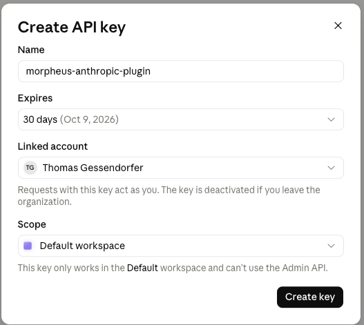
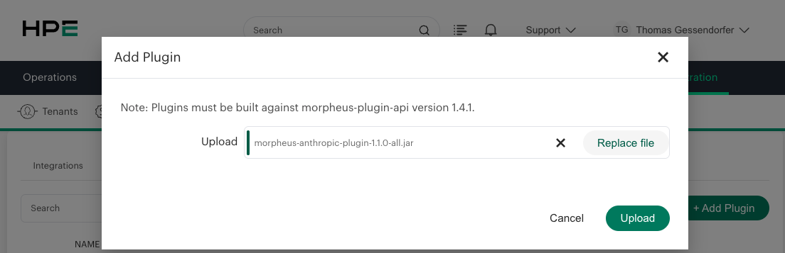
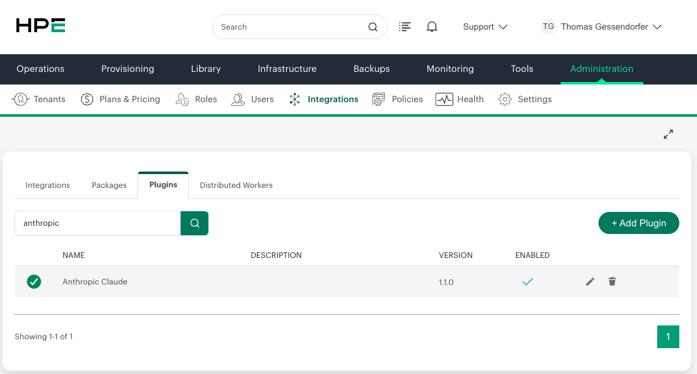
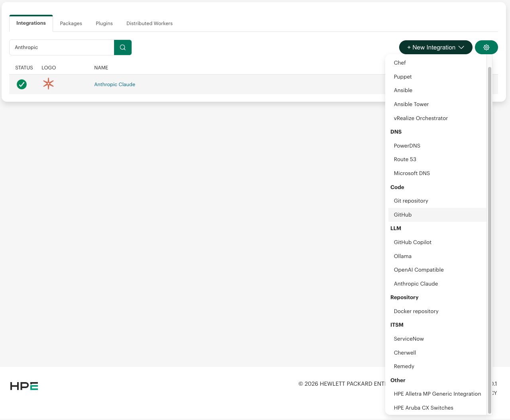
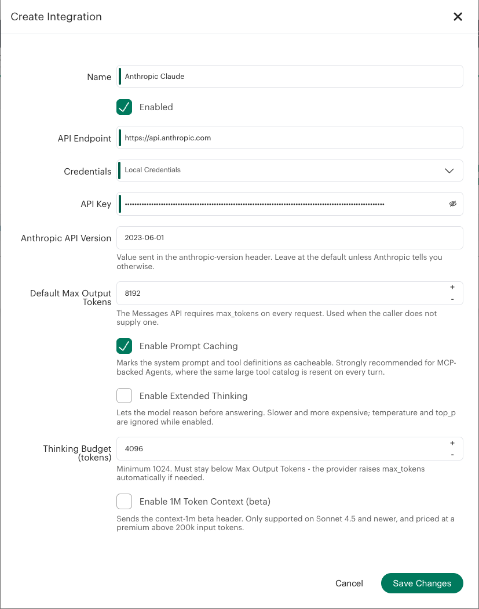
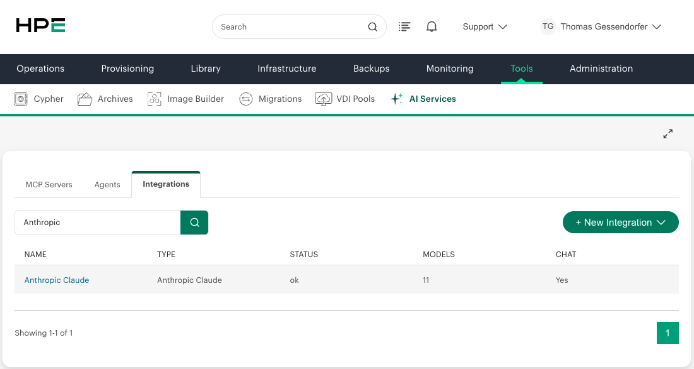
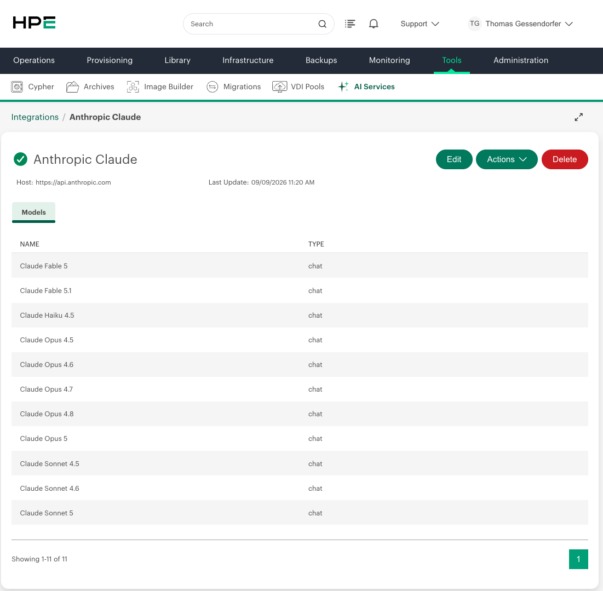
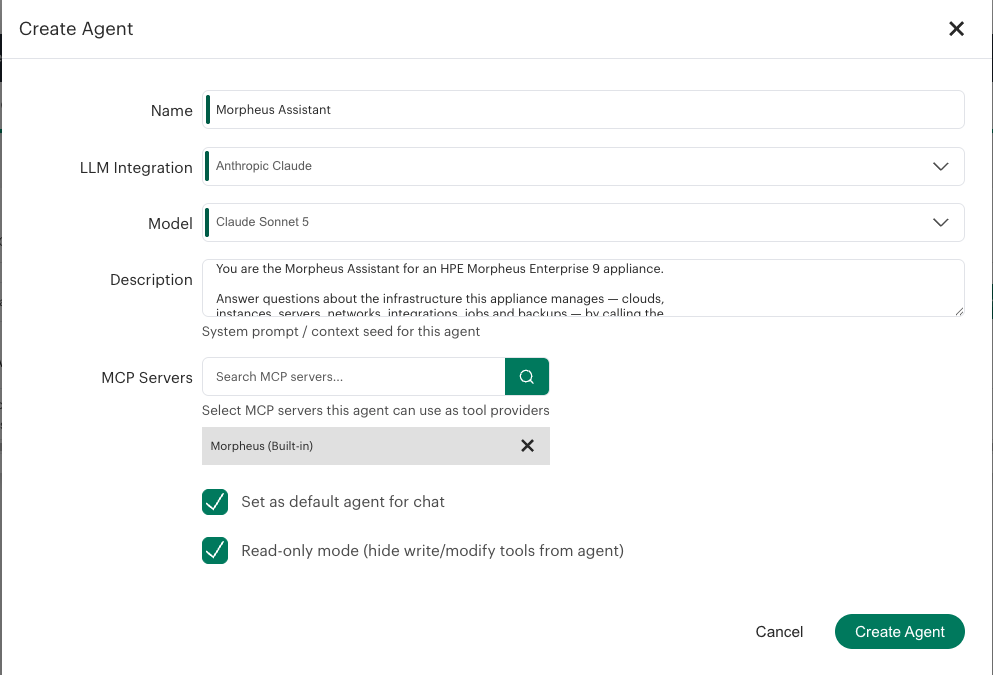
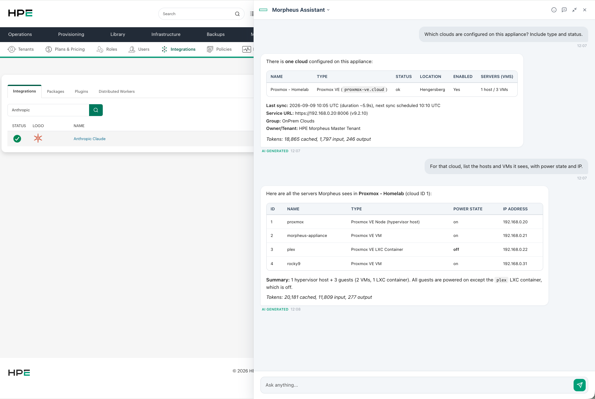

# Morpheus Anthropic Claude LLM Plugin

An `LlmProvider` plugin for HPE Morpheus Enterprise 9.0.0+ that adds **Anthropic Claude** as a
native AI integration type under *Tools > AI Services > Integrations*.

Unlike pointing the shipped `github-copilot` integration at an OpenAI-compatible proxy, this plugin
speaks the **native Anthropic Messages API** (`POST /v1/messages`). That matters for Agents backed by
the Morpheus MCP server, because the OpenAI compatibility layer drops prompt caching and does not
guarantee tool-schema conformance.

> **Independent community project.** Not an official Anthropic or HPE product, and neither endorsed
> by nor affiliated with either company. See [Trademarks](#trademarks).

## What it does

| Capability | Status |
|---|---|
| Chat completions | yes |
| Streaming chat (SSE) | yes |
| Tool use / function calling | yes — full bidirectional translation |
| Prompt caching | yes — system prompt + tool catalog, on by default |
| Extended thinking | yes — optional, with budget control |
| 1M token context (beta) | yes — optional, Sonnet 4.5+ |
| Usage / rate limit sync | yes — from the `anthropic-ratelimit-*` headers |
| Model catalog sync (`GET /v1/models`) | yes |
| Token usage visible in chat | yes — optional footer, since Morpheus shows none |
| Embeddings | no (Anthropic offers no embedding endpoint) |

---

## Quick start

Five steps, roughly ten minutes.

| # | Step | Where |
|---|---|---|
| 1 | [Get an Anthropic API key](#1-get-an-anthropic-api-key) | console.anthropic.com |
| 2 | [Download the plugin JAR](#2-download-the-plugin-jar) | GitHub Releases |
| 3 | [Upload it to the appliance](#3-upload-the-plugin) | Administration > Integrations > Plugins |
| 4 | [Create the AI integration](#4-create-the-ai-integration) | Tools > AI Services > Integrations |
| 5 | [Build an Agent](#5-build-an-agent) | Tools > AI Services > Agents |

### Prerequisites

- **HPE Morpheus Enterprise 9.0.0 or newer.** The plugin declares
  `Morpheus-Min-Appliance-Version: 9.0.0`; older appliances will refuse it.
- **Outbound HTTPS from the appliance to `api.anthropic.com:443`.** This is the one that surprises
  people — the *appliance* makes the call, not your browser. Reaching the API from your workstation
  proves nothing. Test from the appliance itself:
  ```bash
  curl -sS -o /dev/null -w '%{http_code}\n' https://api.anthropic.com/v1/models \
    -H "x-api-key: $ANTHROPIC_API_KEY" -H "anthropic-version: 2023-06-01"
  # 200 = reachable and the key works
  ```
- **Permission to install plugins** (Administration > Integrations). The JAR is unsigned, so an
  appliance policy that requires signed plugins will reject it.

### 1. Get an Anthropic API key

The key comes from the [Anthropic Console](https://console.anthropic.com) under **API keys** →
*Create key*. It looks like `sk-ant-api03-...`.

The Console may first offer **identity federation** instead of a key. Choose
**Continue with an API key**: federation issues short-lived tokens to workloads that already have a
cloud identity (GCP, AWS, Azure, GitHub Actions), which an on-premises Morpheus appliance does not
have — and this plugin authenticates with a static `x-api-key` header, so there is nowhere to feed a
federated token. Rotation stays manual: create a new key, swap it on the integration, revoke the old
one.

> **A Claude Pro or Max subscription does not cover API usage.** Those plans pay for claude.ai and
> Claude Code; the API is billed separately per token. You need an Anthropic Console account with
> **credits or a payment method on file**, otherwise every request comes back
> `400 credit balance is too low`. This catches almost everyone the first time.



Four choices in that dialog are worth a moment:

- **Name** — use a **dedicated key per appliance** (`morpheus-prod`, `morpheus-lab`). Usage becomes
  attributable in the Console, and you can revoke one appliance without touching the others.
- **Expires** — a real trade-off, and neither answer is wrong. An **expiring** key stops working
  *silently from Morpheus' point of view*: the integration just starts returning
  `401 authentication_error` on the expiry date, so put that date in a calendar. **Never** avoids the
  surprise outage but leaves you holding a long-lived secret, which shifts the burden onto storage —
  [store it deliberately](#where-to-put-the-key-use-local-credentials) and know how to revoke it.
- **Linked account** — the key acts as the user who created it and is **deactivated if that person
  leaves the organization**. On a shared appliance that makes one colleague a single point of
  failure.
- **Scope** — a dedicated **workspace** rather than *Default* lets you attach a **spend limit**. An
  agent with tool access can loop, and a workspace budget is the only hard stop.

Copy the key immediately — the Console shows it exactly once.

> **Never commit the key.** Not into this repository, not into a screenshot of the integration form,
> not into a chat with an AI assistant. A leaked `sk-ant-...` key is billable by whoever finds it.
> If it does leak, revoke it in the Console — that is instant and the only real remedy.

#### Where to put the key: use Local Credentials

**Paste the key into the integration form as *Local Credentials*** — the plugin's default. This is
not just the simplest path; on Morpheus 9.0.1 it is currently the only one that works.

The obvious alternative, storing the key under *Infrastructure > Trust > **Credentials*** as an
**API Key** entry and selecting it on the integration, **fails on 9.0.1**. An Anthropic key is around
100 characters, which overflows the internal credential store's `password` column:

```
unknown error creating credential: org.springframework.dao.DataIntegrityViolationException:
Hibernate operation: could not execute statement; Data truncation: Data too long for column
'password' at row 1
```

Nothing about your input causes this and no shorter name or description avoids it — every Anthropic
key is too long for that column. If you hit it, fall back to Local Credentials. An external
credential store (Vault, CyberArk) is not subject to the internal column limit, but we have not
verified that path.

> Whichever you choose, it is the **Credentials** tab — not **Cypher**. The plugin declares its
> credential option with `optionSource: "credentials"` and `credentialTypes: ["api-key"]`, so the
> dropdown is populated from the credential store only; a `secret/...` entry created under
> *Trust > Cypher* will never appear there. Cypher is for scripts and blueprints that call
> `cypher.read()`.

### 2. Download the plugin JAR

Grab `morpheus-anthropic-plugin-<version>-all.jar` from the
[latest release](../../releases/latest) — it is the shaded (`-all`) JAR, which bundles the
dependencies. The plain `.jar` is not what you want.

```bash
gh release download --repo tgessendorfer/morpheus-anthropic-plugin -p '*-all.jar'
```

Or [build it from source](#build-from-source).

### 3. Upload the plugin

**Administration > Integrations > Plugins > + Add Plugin**, then pick the `-all.jar`:



Note the version the dialog quotes for `morpheus-plugin-api` — see
[Version compatibility](#version-compatibility) if it does not match what this plugin was built
against.

After **Upload**, the plugin appears under *Administration > Integrations > **Plugins*** with a green
status dot and the **Enabled** check set. It registers one provider of type `LLM` named
*Anthropic Claude*.



If the status dot is not green, open the row: the status message names the cause. See
[Troubleshooting](#troubleshooting).

### 4. Create the AI integration

**Tools > AI Services > Integrations**, then open the dropdown on **+ New Integration** — the type
list lives there, not on a page of its own. Under **LLM** you will find **Anthropic Claude** next to
the built-in providers:





Fill in:

| Field | Value |
|---|---|
| **Name** | anything, e.g. `Anthropic Claude` |
| **API Endpoint** | `https://api.anthropic.com` (a full `/v1/messages` URL is tolerated and trimmed) |
| **Credentials** | *Local Credentials* — paste the `sk-ant-...` key into the field below. The credential-store alternative [does not work on 9.0.1](#where-to-put-the-key-use-local-credentials) |
| **Anthropic API Version** | leave at `2023-06-01` |
| **Default Max Output Tokens** | `8192` is a sane start; raise it for long agent answers |
| **Enable Prompt Caching** | leave **on** — see [why](#prompt-caching--why-this-plugin-exists) |
| **Enable Extended Thinking** | off by default |
| **Thinking Budget** | only when thinking is on; must be below max output tokens |
| **Enable 1M Token Context** | off by default; Sonnet 4.5+ only |
| **Send temperature and top_p** | **leave off.** Morpheus sends a temperature on every chat request and newer Claude models reject it — see [below](#why-sampling-parameters-are-off-by-default) |
| **Append token usage to answers** | optional. Adds an italic token line to each final answer — the only way to see caching without the appliance log |

**Save.** The integration verifies itself by calling `GET /v1/models`, which doubles as the
connectivity test and populates the model catalog. A save that succeeds means the appliance reached
Anthropic and the key is valid.

A healthy integration reports **Status `ok`**, a non-zero **Models** count and **Chat: Yes**:



Opening it shows the synced catalog. Every entry is typed `chat` — Anthropic has no embedding
endpoint, so no embedding models appear.



A populated model list is your proof that everything upstream worked: the appliance reached
Anthropic, the key was accepted, and `LlmModelsSync` wrote the catalog.

#### Why sampling parameters are off by default

Morpheus' chat layer attaches a `temperature` to every request. Newer Claude models refuse it:

```
400 invalid_request_error: `temperature` is deprecated for this model.
```

Morpheus reports that failure in the chat window as **"The AI model is no longer available. Please
update the AI agent settings or contact your administrator."** — which points at the model reference
rather than the actual cause, and sends you looking in the wrong place. The model is fine.

So the plugin withholds `temperature` and `top_p` unless you tick **Send temperature and top_p**.
Turn it on only against models that still accept them; Anthropic's own defaults apply otherwise.

Two further option interactions worth knowing:

- **Extended thinking drops `temperature` and `top_p`.** The API rejects them alongside thinking, so
  the provider strips them and raises `max_tokens` above the thinking budget automatically. Thinking
  output lands in the response *metadata*, not the message body.
- **1M context is priced at a premium** above 200k input tokens, and applies only to Sonnet 4.5+.
  Below that threshold, and on other models, billing is unchanged.

### 5. Build an Agent

**Tools > AI Services > Agents > Create Agent** → pick this integration, attach the built-in
**Morpheus MCP server**, and add your system prompt.



Two settings deserve thought:

- **Read-only mode** hides the write and modify tools from the agent. Leave it **on** for a first
  run: the built-in Morpheus MCP server exposes destructive tools, and an agent that loops or reads
  an instruction too literally would have write access to your infrastructure. The reduced catalog is
  still far above the 1024-token minimum a cache breakpoint needs.
- **The description is the system prompt**, and prompt caching depends on it being **byte-identical
  between turns**. Keep timestamps, user names and any other varying context out of it, or the cached
  prefix is invalidated on every turn and `cache_read_input_tokens` stays at zero.



That exchange is the plugin working end to end: Claude calls the Morpheus MCP tools, reads the
results, and answers from them as tables.

The token footers are the interesting part. The second answer reports **20,181 cached against 11,809
input** — more than half the input tokens for that turn were served from the prompt cache instead of
being re-billed, and the tool catalog is what sits in that cached prefix. This is the effect the
OpenAI compatibility layer cannot deliver, made visible without leaving the chat window.

---

## Prompt caching — why this plugin exists

The Morpheus MCP server advertises 67 tool definitions on first contact and grows from there.
Those definitions are **identical on every turn** of an Agent conversation, but without caching they
are re-billed as fresh input tokens each time — and a tool-heavy agent run is many turns.

With caching enabled (the default) the provider sets a `cache_control` breakpoint on the system
prompt and on the last tool definition, which makes Anthropic cache the whole stable prefix. Cache
reads are billed at roughly a tenth of normal input tokens, and time-to-first-token drops noticeably.
Anthropic returns the hit and miss counts as `cache_read_input_tokens` and
`cache_creation_input_tokens`; Morpheus renders neither, so the plugin surfaces them itself — see
[Proving it works](#proving-it-works).

This is exactly what the OpenAI compatibility layer cannot do — it drops prompt caching entirely.

### Proving it works

Morpheus displays no token or cache counts anywhere in the chat UI. Two ways to see them:

**In the chat** — tick **Append token usage to answers** on the integration. Each final answer then
ends with an italic line:

> *Tokens: 20,181 cached, 18,330 input, 302 output*

Only final answers get it. A turn that ends in a tool call is replayed to Anthropic as conversation
history on the next request, so a footer there would enter the model's own context and be re-billed
every turn after. The line is deliberately plain ASCII: Morpheus' storage path corrupts non-ASCII
characters on that replay, and an arrow glyph in an early version killed the follow-up request with
`400 ... str is not valid UTF-8: surrogates not allowed`. Markdown italics are as subtle as it gets
— the chat renderer escapes raw HTML, so `<sub>` for smaller type shows up as literal tags.

**In the appliance log** — always on, one line per response:

```bash
tail -f /var/log/morpheus/morpheus-ui/current | grep 'Anthropic prompt cache'
```

A real two-question conversation against the built-in Morpheus MCP server, oldest line first:

```
Anthropic prompt cache: read=0     created=14982 uncached_input=94    output=57
Anthropic prompt cache: read=0     created=18865 uncached_input=635   output=28
Anthropic prompt cache: read=18865 created=0     uncached_input=1797  output=203
Anthropic prompt cache: read=18865 created=0     uncached_input=2028  output=94
Anthropic prompt cache: read=0     created=20181 uncached_input=3209  output=51
Anthropic prompt cache: read=20181 created=0     uncached_input=4198  output=101
...
Anthropic prompt cache: read=20181 created=0     uncached_input=13800 output=300
```

Note the line count: **eleven API calls for two user questions**, because every tool round-trip is
its own request. Each of those would otherwise re-bill the whole MCP tool catalog as fresh input.
Here 158,816 tokens were served from cache against 54,028 written — and cache reads bill at roughly a
tenth. `uncached_input` growing from 94 to 13,800 is the conversation itself, which is correctly not
cached; only the stable prefix is.

Run an agent conversation of at least two turns, then read those lines — or the response metadata,
if you are calling the provider directly:

- **Turn 1** — `cache_creation_input_tokens` > 0, `cache_read_input_tokens` = 0. The prefix was
  written to the cache.
- **Turn 2 onwards** — `cache_read_input_tokens` > 0. The prefix was served from cache; those tokens
  bill at roughly a tenth.

If turn 2 still shows zero cache reads, the usual causes are: caching switched off on the
integration, a system prompt that changes between turns (timestamps are a classic), fewer than 1024
tokens in the cacheable prefix, or more than five minutes of idle time between turns (the cache TTL).

### The interesting part: the tool bridge

Morpheus passes tool definitions and tool call results around in the **OpenAI shape**
(`tool_calls`, `tool_call_id` inside `LlmChatMessage.metadata`). Anthropic uses `tool_use` and
`tool_result` **content blocks**. `AnthropicProvider` translates both directions:

| Morpheus / OpenAI | Anthropic Messages API |
|---|---|
| `role: system` message | top-level `system` field (all system turns concatenated) |
| `tools: [{type:function, function:{name, description, parameters}}]` | `tools: [{name, description, input_schema}]` |
| `tool_choice: "required"` / `"none"` / `{function:{name}}` | `{type:"any"}` / `{type:"none"}` / `{type:"tool", name}` |
| assistant `tool_calls[]` with JSON-string `arguments` | assistant `tool_use` blocks with parsed object `input` |
| `role: tool` + `tool_call_id` | `tool_result` block inside a **user** message (consecutive results merged) |
| `finish_reason: tool_calls` | `stop_reason: tool_use` |
| `max_tokens` optional | `max_tokens` **mandatory** — defaulted per integration |

---

## Troubleshooting

| Symptom | Cause and fix |
|---|---|
| Plugin uploads but status is not `loaded` | Open the plugin row and read the status message. A `NoSuchMethodError` or `ClassNotFoundException` points at a [plugin-api version mismatch](#version-compatibility); a signature complaint means appliance policy rejects unsigned plugins. |
| Saving the integration fails with a connection or timeout error | The appliance cannot reach `api.anthropic.com:443`. Check egress firewall rules and any proxy — run the `curl` from [Prerequisites](#prerequisites) **on the appliance**. |
| `Data truncation: Data too long for column 'password'` when adding an API Key credential | Morpheus 9.0.1's internal credential store cannot hold a ~100-character Anthropic key. Use *Local Credentials* on the integration instead — see [Where to put the key](#where-to-put-the-key-use-local-credentials). |
| The integration logo still shows the previous version's icon after an upgrade | Browser cache — the asset keeps the same URL across plugin versions. Hard-reload the page (`Cmd`/`Ctrl` + `Shift` + `R`). A private window confirms it in seconds: if the icon is correct there, nothing is wrong with the plugin. |
| Chat says **"The AI model is no longer available"** | Misleading: Morpheus renders any provider error during chat this way. Check the appliance log for the real cause — most often `400 \`temperature\` is deprecated for this model`, fixed by leaving [**Send temperature and top_p**](#why-sampling-parameters-are-off-by-default) off. |
| `401 authentication_error` | Bad or revoked key. Note the plugin authenticates with `x-api-key`, never `Authorization: Bearer` — `api.anthropic.com` rejects Bearer. |
| `400 credit balance is too low` | The Console account has no credits. A Pro/Max subscription does not cover API usage — see [step 1](#1-get-an-anthropic-api-key). |
| `404 model_not_found` | The model is not enabled for your organization, or the name is stale. Re-save the integration to re-run the model sync. |
| TLS handshake failures | Behind a TLS-inspecting proxy, drop the proxy CA into `/etc/pki/ca-trust/source/anchors/`, run `update-ca-trust`, then `morpheus-ctl restart`. |
| `cache_read_input_tokens` stays 0 after turn 2 | See [Proving it works](#proving-it-works). |
| Thinking enabled and requests get rejected | The thinking budget must be **below** max output tokens. The provider raises `max_tokens` automatically, but an explicit per-request `max_tokens` below the budget still fails. |

Appliance-side logs for the plugin (model and usage sync errors land here):

```bash
tail -f /var/log/morpheus/morpheus-ui/current | grep -i anthropic
```

### Version compatibility

| | |
|---|---|
| Minimum appliance | 9.0.0 (`Morpheus-Min-Appliance-Version`) |
| Built against `morpheus-plugin-api` | see `morpheusPluginApiVersion` in [`gradle.properties`](gradle.properties) |

The **Add Plugin** dialog states the `morpheus-plugin-api` version your appliance expects. A plugin
built against an *older* API than the appliance generally loads fine; one built against a *newer*
API can fail at class-load time. If the versions differ and the plugin will not load, set
`morpheusPluginApiVersion` in `gradle.properties` to the version the dialog names and
[rebuild](#build-from-source).

---

## Build from source

Requires JDK 11–17 (**not 21** — Groovy 3.0.9) and the bundled Gradle wrapper.

```bash
export JAVA_HOME=/usr/lib/jvm/java-17-openjdk-amd64
./gradlew clean test shadowJar
# -> build/libs/morpheus-anthropic-plugin-<version>-all.jar
```

`./gradlew test` runs the Spock suite. CI builds every push and attaches the shaded JAR to tagged
releases (`.github/workflows/`).

---

## Requirements & caveats

- The **appliance** makes the outbound call. `api.anthropic.com:443` must be reachable from the
  appliance, not just from your workstation.
- Authentication uses the `x-api-key` header. `apiToken` is deliberately left unset on the
  `HttpApiClient` request options, because an `Authorization: Bearer` header makes
  `api.anthropic.com` reject the request.
- Context window is reported as 200k unless the 1M beta is enabled (Sonnet 4.5+ only).
- The plugin is unsigned. Depending on appliance policy you may need to allow unsigned plugins.
- Usage metrics come from a tiny probe request (`max_tokens: 1`) issued during refresh, using the
  cheapest enabled model. Anthropic reports per-minute buckets for requests, input tokens and output
  tokens; Morpheus models a single token bucket, so the **input token** bucket is surfaced.
- API cost is billed by Anthropic per token, entirely outside Morpheus licensing. Set a spend limit
  in the Console if an agent might loop.

## Relationship to the Local LLM plugin

Morpheus also ships `local-llm-plugin` (`com.morpheusdata.localllm`) on the Exchange, which registers
two providers — `ollama` and `openai-compatible`. The two plugins are complementary, not competing:

| Use case | Plugin |
|---|---|
| Ollama on your own VM | `local-llm-plugin` → `ollama` |
| vLLM / LiteLLM / any OpenAI-shaped endpoint | `local-llm-plugin` → `openai-compatible` |
| Claude with caching, thinking and native tool use | this plugin |

Install both and you can switch an Agent between a local model and Claude by changing its LLM
integration, with no other configuration changes.

## Attribution

Derived from the Apache 2.0 licensed
[HewlettPackard/morpheus-copilot-plugin](https://github.com/HewlettPackard/morpheus-copilot-plugin)
(structure, Gradle setup, session-scoped HTTP client pattern). Licensed under Apache 2.0.

### Trademarks

This is an independent, community-built plugin. It is **not** an official Anthropic or HPE product,
and it is neither endorsed by nor affiliated with either company.

"Anthropic" and "Claude" are trademarks of Anthropic PBC; "HPE", "Hewlett Packard Enterprise" and
"Morpheus" are trademarks of Hewlett Packard Enterprise. They are used here solely to identify the
services this plugin integrates with.

The icon shipped in `src/assets/images/` is an original mark drawn for this project. It is not an
Anthropic brand asset, and no official Anthropic logo is redistributed here — Apache 2.0 grants no
trademark rights (§6), so a third-party logo could not be covered by this repository's license
anyway.
